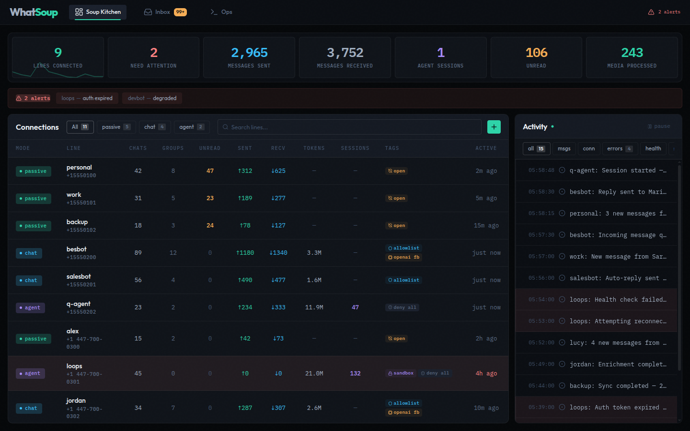
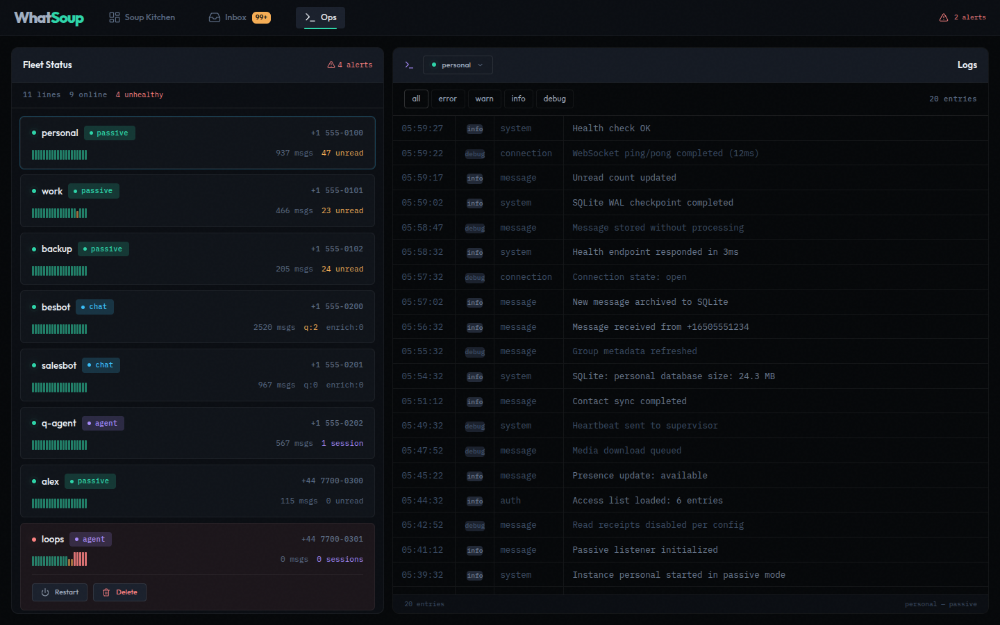
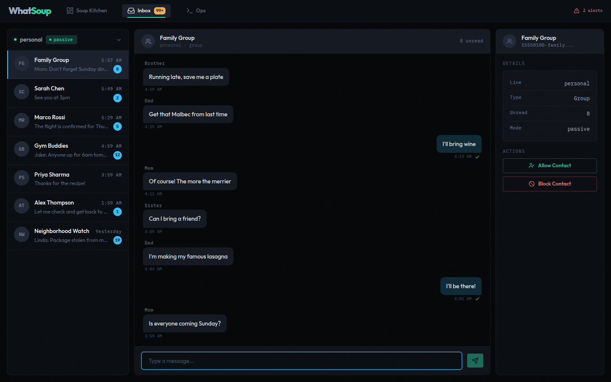
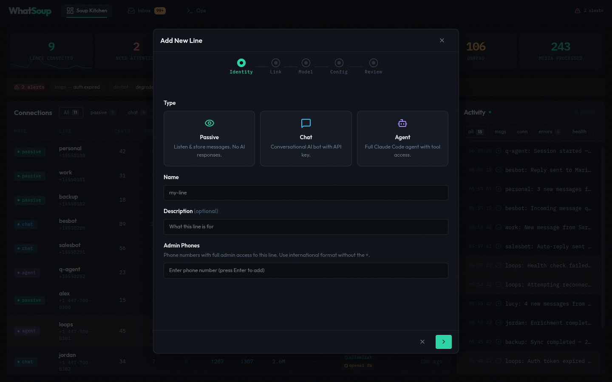

# WhatSoup

A multi-instance WhatsApp platform that runs three fundamentally different runtimes — passive listener, conversational chatbot, and autonomous AI agent — behind one Baileys v7 connection per line. Ships with a fleet management console for provisioning, monitoring, and operating all instances from a single dashboard.

One process per instance. One SQLite database per instance. 127 MCP tools. No build step. Probably too many MCP tools.

## What It Does

Each WhatsApp number gets its own isolated process with its own runtime mode:

| Mode | What Happens | Use Case |
|------|-------------|----------|
| **passive** | Stores messages. Does nothing else. Manual read/reply via MCP tools. | Personal number — just want the data accessible |
| **chat** | Calls an LLM API (Anthropic/OpenAI) with optional RAG via Pinecone. Stateless request-response. | Customer support bot, Q&A assistant |
| **agent** | Spawns a Claude Code SDK subprocess with tool access, file I/O, and multi-turn sessions. | Autonomous task execution, research, project work |

These are not configuration flags on one bot. They are different codepaths with different message flows, different dependencies, and different failure modes. Treating them as settings on the same runtime was the mistake the previous two repos made.

## Fleet Console

A React dashboard for managing the entire fleet from a browser. Runs on the same port as the fleet server (production) or via Vite dev proxy (development).

### Fleet Overview

KPI cards, connection table, heartbeat strips, and live activity feed across all instances.



### Operations

Health monitoring with restart, delete, and re-link actions for unhealthy instances. Log viewer with level filtering.



### Inbox

Unified message inbox — select a line and chat, read messages with bubble rendering, send replies, manage contact access.



### Add Line Wizard

5-step provisioning flow: Identity (type, name, admin phones) → Link (QR scan) → Model & Auth → Config → Review. Type-matched accent colors, inline validation, auto-generated defaults.



### Instance Lifecycle

| Action | Where | What It Does |
|--------|-------|--------------|
| **Add Line** | Wizard | 5-step flow: Identity → QR scan → Model → Config → Review |
| **Re-link** | LineDetail, Ops | Standalone QR modal for re-authenticating a disconnected instance |
| **Configure** | LineDetail | Edit model, access, prompt, and agent settings on stopped instances |
| **Delete** | LineDetail, Ops | Full teardown with confirmation — stops process, disables unit, removes all data |

**Design system:** 60+ CSS custom properties, 40+ ESLint rules enforcing token usage. No hardcoded colors, spacing, or transition durations in components.

```bash
# Development
cd console && npm run dev          # Vite dev server with hot reload + API proxy

# Production build
cd console && npm run build        # Outputs to dist/, served by fleet server
```

## Requirements

- **Node.js >= 23.10** — native `--experimental-strip-types`, no transpilation (`node -v` to check)
- **Linux with systemd** — user units for process management (`systemctl --user`); enable lingering for headless servers: `loginctl enable-linger $USER`
- **GNOME Keyring** (`libsecret-tools`) or environment variables for API keys — `npm run setup` checks both
- **ffmpeg** — video frame extraction in chat mode (optional)

## Quick Start

```bash
# 1. Clone and install
git clone https://github.com/LucasQuiles/WhatSoup.git
cd WhatSoup
npm install

# 2. Run setup (installs systemd unit, wrapper scripts, builds console)
npm run setup

# 3. Start the fleet server
npm run fleet

# 4. Open http://localhost:9099 and create your first instance
#    Click "Add Line" → choose a type → scan the QR code with WhatsApp
```

The setup script installs the systemd template unit, symlinks the wrapper script to `~/.local/bin`, builds the console, and checks for API keys in your keyring. After setup, `npm run fleet` is the only command you need — everything else is managed from the browser.

For development:

```bash
npm run typecheck         # tsc --noEmit
npm test                  # ~2000 tests, ~15s, real SQLite, no mocks
cd console && npm run dev # Vite dev server with hot reload + API proxy
```

## Architecture

```
src/
  core/           DB, access control, messages, durability engine, JID handling
  transport/      Baileys v7 — auth, reconnection, parsing, event routing
  mcp/            Tool registry (127 tools), Unix socket server, 13 tool modules
  runtimes/
    passive/      Store-only. No auto-response. MCP socket for external access.
    chat/         LLM API — Anthropic/OpenAI, Pinecone RAG, enrichment, media
    agent/        Claude Code subprocess — sessions, sandbox, outbound queue
  fleet/          Fleet management server — discovery, health polling, API routes
    routes/       REST API handlers (lines, ops, data, feed)
    discovery.ts  Config-dir scanner, instance registry
    health-poller.ts  5-second health probe per instance
    static.ts     SPA serving with token injection
  lib/            Shared utilities — HTTP helpers, text utils, validation
  config.ts       Instance-aware config from JSON + env vars
  logger.ts       Pino structured logging with daily rotation
  main.ts         Bootstrap, lifecycle, health server

console/
  src/
    components/   21 React components (modals, cards, badges, forms, wizards)
    pages/        4 pages (SoupKitchen, Ops, Inbox, LineDetail)
    hooks/        React Query data hooks, toast system, sticky scroll
    lib/          API client with mock fallback, formatting, text utils
    index.css     Design system — tokens, utilities, component classes

deploy/
  whatsoup@.service   systemd template unit (one per instance)
  hooks/              Agent sandbox enforcement
```

## Fleet API

The fleet server exposes a REST API on `127.0.0.1:9099` with Bearer token auth.

| Method | Path | Description |
|--------|------|-------------|
| `GET` | `/api/lines` | List all instances with health status |
| `GET` | `/api/lines/:name` | Detailed instance view with config |
| `POST` | `/api/lines` | Create a new instance |
| `DELETE` | `/api/lines/:name` | Delete an instance (stop + cleanup) |
| `PATCH` | `/api/lines/:name/config` | Update instance configuration |
| `GET` | `/api/lines/:name/auth` | SSE stream for QR code authentication |
| `POST` | `/api/lines/:name/restart` | Restart systemd unit |
| `POST` | `/api/lines/:name/stop` | Stop systemd unit |
| `POST` | `/api/lines/:name/send` | Send a message through the instance |
| `POST` | `/api/lines/:name/access` | Update access control |
| `GET` | `/api/lines/:name/chats` | List chats for an instance |
| `GET` | `/api/lines/:name/messages` | Fetch messages for a chat |
| `GET` | `/api/lines/:name/access` | View access control list |
| `GET` | `/api/lines/:name/logs` | View instance logs |
| `GET` | `/api/feed` | Activity feed (all instances) |
| `GET` | `/api/typing` | Currently typing indicators |

The fleet token is stored at `~/.config/whatsoup/fleet-token` (auto-generated on first run).

## Instance Model

Each instance is an independent systemd service with isolated auth, database, logs, and config:

```
~/.config/whatsoup/instances/<name>/config.json    # what mode, what model, what access
~/.config/whatsoup/instances/<name>/auth/           # WhatsApp Baileys credentials
~/.local/share/whatsoup/instances/<name>/bot.db     # messages, contacts, sessions
~/.local/state/whatsoup/instances/<name>/            # lock files, MCP socket
```

Config example (chat mode):

```json
{
  "name": "support",
  "type": "chat",
  "systemPrompt": "You are a helpful assistant.",
  "models": { "conversation": "claude-sonnet-4-6" },
  "accessMode": "open_dm",
  "adminPhones": ["15555550100"],
  "maxTokens": 500,
  "rateLimitPerHour": 60,
  "healthPort": 9093
}
```

Access modes: `self_only` (just you), `allowlist` (approved contacts), `open_dm` (anyone can message), `groups_only` (WhatsApp groups only).

## Key Concepts

**conversation_key** — Canonical chat identity that stays stable when WhatsApp aliases JIDs between `@s.whatsapp.net` and `@lid`. Every query uses this instead of raw JIDs. Getting this wrong was responsible for roughly 40% of the bugs in the predecessor repos.

**ToolRegistry** — In-process MCP tool declarations with scope enforcement (`chat`-scoped vs `global`) and replay policy (`read_only`, `safe`, `unsafe`). Chat-scoped tools only see messages from the current conversation. Global tools see everything. The distinction matters when one instance serves multiple contacts.

**Durability engine** — Two-phase commit for message delivery. Inbound journal captures what arrived. Outbound ops track what was sent. Echo correlation confirms delivery. If the process crashes between receiving a message and sending the reply, the journal replays on restart.

**Media bridge** — Unix socket per workspace that lets Claude Code subprocesses send WhatsApp media (images, documents, audio) without direct Baileys access. The agent runtime owns the bridge; the subprocess just writes to a socket.

**linkedStatus** — Each instance in the fleet API includes `linkedStatus: 'linked' | 'unlinked'` based on whether Baileys auth credentials exist. Unlinked instances show a "Re-link" button instead of "Restart" since they need QR authentication before they can run.

## Health & Monitoring

Each instance runs an HTTP health server:

```bash
curl http://127.0.0.1:9093/health
```

Returns connection status, uptime, message counts, enrichment state, durability stats, and model configuration. The health port is configurable per instance.

The fleet server's health poller probes each instance every 5 seconds and tracks consecutive failures to determine status: `online` → `degraded` (1-2 failures) → `unreachable` (3+). The console displays this as a color-coded heartbeat strip.

## Testing

```bash
npm test              # ~2000 tests, ~15s
npm run test:watch    # watch mode
npm run typecheck     # tsc --noEmit
```

Tests use real SQLite (`:memory:` or temp files) and real Unix sockets. No infrastructure mocks. If the test passes, it works. If it doesn't, the mock was lying to you — which is why there aren't any.

## Documentation

| Document | Description |
|----------|-------------|
| [Configuration Reference](docs/configuration.md) | Full config schema, env vars, worked examples |
| [MCP Tool Reference](docs/tools.md) | All 127 tools with scopes, parameters, replay policies |
| [Runbook](docs/runbook.md) | Operational procedures and troubleshooting |

## License

MIT
