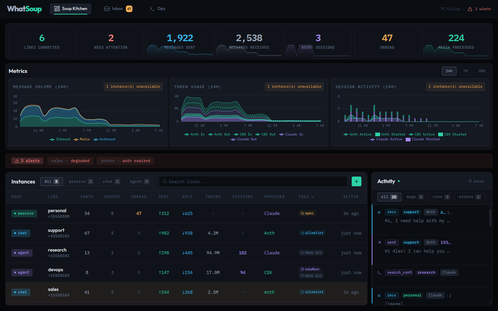
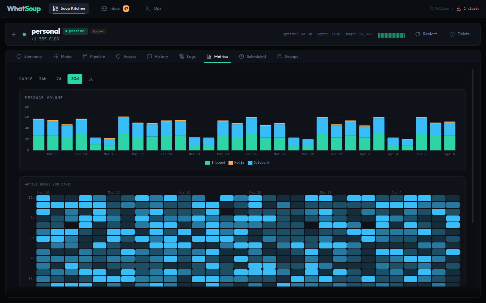
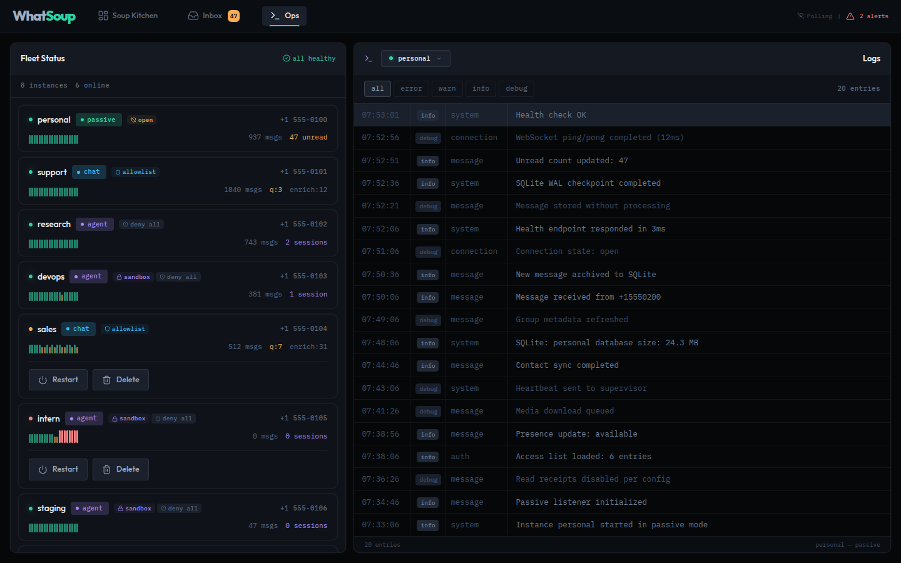
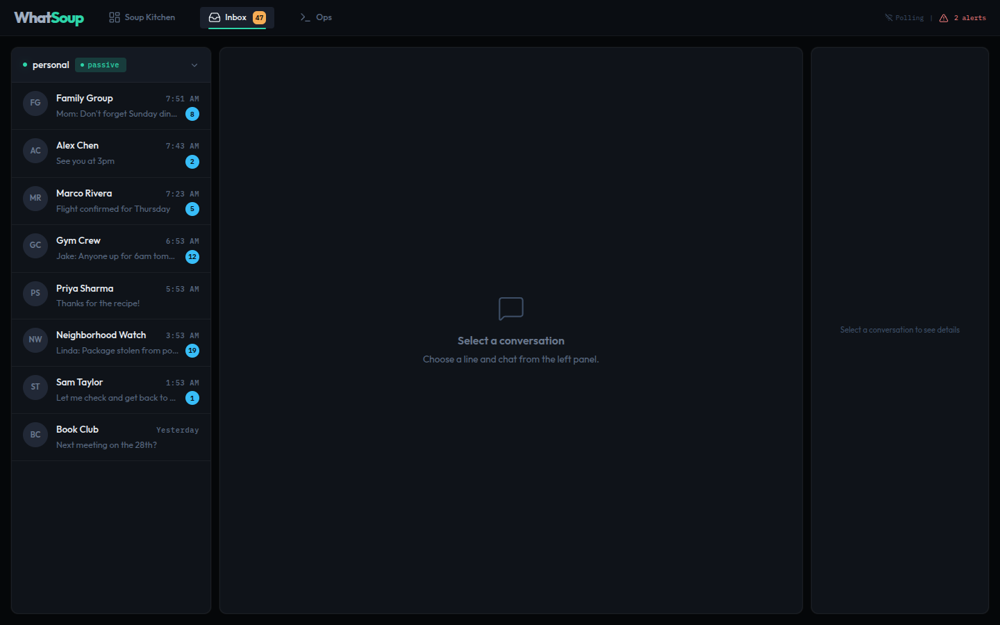

# WhatSoup

A multi-instance WhatsApp platform that runs three fundamentally different runtimes — passive listener, conversational chatbot, and autonomous AI agent — behind one Baileys v7 connection per line. Ships with a fleet management console for provisioning, monitoring, and operating all instances from a single dashboard.

One process per instance. One SQLite database per instance. 166 MCP tools (163 always-registered + 3 conditionally-registered: `knowledge_search` when Pinecone config, credentials, and profiles are usable, `emit_heal_result` on non-sandboxed instances with at least one configured control-plane peer, and `memory_write` when a Pinecone key and index are configured). No backend build step — the runtime executes TypeScript directly via Node `--experimental-strip-types`; only the React console builds (to the repository-level `dist/`). Probably too many MCP tools.

## What It Does

Each WhatsApp number gets its own isolated process with its own runtime mode:

| Mode | What Happens | Use Case |
|------|-------------|----------|
| **passive** | Stores messages. Does nothing else. Manual read/reply via MCP tools. | Personal number — just want the data accessible |
| **chat** | Calls an LLM API (Anthropic/OpenAI) with optional RAG via Pinecone. Stateless request-response. | Customer support bot, Q&A assistant |
| **agent** | Spawns an agent-CLI subprocess with tool access, file I/O, and multi-turn sessions. `claude-cli` is the default provider; `codex-cli`, `gemini-cli`, and `opencode-cli` and the direct OpenAI/Anthropic APIs are also supported, with fallback chains and primary-model probes. | Autonomous task execution, research, project work |

These are not configuration flags on one bot. They are different codepaths with different message flows, different dependencies, and different failure modes. Treating them as settings on the same runtime was the mistake the previous two repos made.

## Fleet Console

A React 19 dashboard for managing the entire fleet from a browser. Built with TypeScript, Tailwind CSS v4, React Query, and Recharts. Runs on the same port as the fleet server (production) or via Vite dev proxy (development).

### Fleet Overview

KPI cards with sparklines, three fleet-wide charts (message volume, token usage by provider, session activity by provider), instance table with sorting/filtering, and live activity feed with provider badges.



### Line Detail — Metrics

Per-instance metrics with stacked bar chart, active hours heatmap (7-day weekly pattern or 30-day per-date grid), and tabbed token/session detail views. Nine tabs: Summary, Mode, Pipeline, Access, History, Logs, Metrics, Scheduled, Groups.



### Operations

Fleet status dashboard with health monitoring, restart/delete/re-link actions for unhealthy instances, and log viewer with level filtering.



### Inbox

Unified message inbox with chat list, message bubbles, send/reply, contact management (save, allow, block), and mark-read support. Line picker for switching between instances.



### Instance Lifecycle

| Action | Where | What It Does |
|--------|-------|--------------|
| **Add Line** | Wizard | 5-step flow: Identity → QR scan → Model → Config → Review |
| **Re-link** | LineDetail, Ops | Standalone QR modal for re-authenticating a disconnected instance |
| **Configure** | LineDetail | Edit model, access, prompt, and agent settings on stopped instances |
| **Mark Read** | Inbox | Mark conversations as read — zeroes unread count and syncs to WhatsApp |
| **Delete** | LineDetail, Ops | Full teardown with confirmation — stops process, disables unit, removes all data |

### Design System

60+ CSS custom properties in a Tailwind v4 `@theme` block. Type scale (`--text-xs` through `--text-2xl`) maps directly to `text-*` utility classes. 40+ ESLint rules enforce token usage — hardcoded colors, spacing, font sizes, and transitions are lint errors. Custom component classes (`c-card`, `c-btn`, `c-hover`, `c-border-*`) provide consistent surfaces with hover/transition behavior. Form resets and body styles are wrapped in `@layer base` so utility overrides work correctly.

### WebSocket Realtime

The fleet server broadcasts invalidation events over WebSocket. The console subscribes and automatically refetches stale data — no polling delay for messages, chat updates, log changes, access changes, or LID-mapping conflicts. Falls back to polling when WebSocket is disconnected.

The invalidation event types are `instance_status`, `message_received`, `chat_updated`, `log_entry`, `feed_event`, `access_changed`, and `lid_conflict`. `lid_conflict` is emitted when fleet sync detects two instances disagree on a `lid → phone_jid` mapping; the conflicting LID is carried in the event's `lid` field, and console clients refetch the `/api/lid-mappings` panel. Typing indicators travel on a separate channel: the latency-sensitive `typing_update` event ships full state inline so clients update directly without a refetch round-trip.

```bash
# Development
cd console && npm run dev          # Vite dev server with hot reload + API proxy

# Production build
cd console && npm run build        # Outputs to dist/, served by fleet server
```

## Requirements

### Host deployment (systemd / launchd)

- **Node.js >= 24.0.0 and < 26** (pinned to `24.15.0` via `.nvmrc` / `volta` / `packageManager`) — native `--experimental-strip-types`, no transpilation (`node -v` to check)
- **Linux with systemd** — user units for process management (`systemctl --user`); enable lingering for headless servers: `loginctl enable-linger $USER`
- **macOS with launchd** — per-user `LaunchAgents` plists for the fleet and each instance; see the [macOS subsection](#macos-launchd) below
- **GNOME Keyring** (`libsecret-tools`) on Linux, macOS Keychain on Darwin, or environment variables for API keys — the Linux setup script checks GNOME Keyring; the macOS runbook covers Keychain-backed secrets
- **ffmpeg** — video frame extraction in chat mode (optional)

WhatSoup auto-detects the host platform via `src/fleet/platform.ts` (`linux-systemd`, `macos-launchd`, `docker`, or `linux-no-systemd`) and routes service control (`start`/`stop`/`restart`) through the matching backend — `systemctl --user` on Linux, `launchctl` on macOS, in-process supervision under Docker. The same Fleet API endpoints work everywhere.

#### macOS (launchd)

- **Canonical operator runbook:** [docs/runbooks/macos-launchd-deployment.md](docs/runbooks/macos-launchd-deployment.md) — plist patterns (`com.whatsoup.<instance>.plist`, `com.whatsoup.fleet.plist`), Keychain-backed secrets, `PATH` handling for Homebrew Node, and per-instance health-token files.
- **Service template:** `deploy/whatsoup@.service` is the systemd template; the matching launchd plists are generated per-instance under the `deploy:launchd.generated` public surface (see [docs/public-surface.md](docs/public-surface.md) — regeneration is non-destructive by policy).
- **Platform-detection seam:** `src/fleet/platform.ts` is the single source of truth for which service manager runs — override with `WHATSOUP_DOCKER=1` to force the supervisor path inside containers.
- The [Quick Start](#quick-start) below targets Linux/systemd as the primary path; macOS operators should follow the runbook for plist installation and `launchctl kickstart` lifecycle checks after `npm ci`.

### Docker deployment

- **Docker** with Compose V2 (`docker compose version`)
- No Node.js, systemd, or keyring required — the image bundles everything

> **Dependency policy:** Production and dev dependencies in `package.json` and `console/package.json` use caret-range constraints; reproducibility is enforced by the committed `package-lock.json` files, which pin every direct and transitive version. Always use `npm ci` (not `npm install`) in CI and on fresh checkouts so the lockfile is honored exactly. Lockfile updates are reviewed before merge as the supply-chain boundary.

## Quick Start

```bash
# 1. Clone and install
git clone https://github.com/LucasQuiles/WhatSoup.git
cd WhatSoup
npm ci

# 2. Run setup (installs systemd unit, wrapper scripts, builds console)
npm run setup

# 3. Start the fleet server
npm run fleet

# 4. Open http://localhost:9099 and create your first instance
#    Click "Add Line" → choose a type → scan the QR code with WhatsApp
```

The console starts **locked**: paste the fleet token at the lock screen. The
token is auto-generated on first run and stored at
`~/.config/whatsoup/fleet-tokens.json` (use the `active` value; the server log
prints only a prefix). See [docs/console-guide.md](docs/console-guide.md) for
console authentication details.

The setup script installs the systemd template unit, symlinks the wrapper script to `~/.local/bin`, builds the console, and checks for API keys in your keyring. After setup, `npm run fleet` is the only command you need — everything else is managed from the browser.

### Docker Quick Start

```bash
# 1. Clone and configure
git clone https://github.com/LucasQuiles/WhatSoup.git
cd WhatSoup
cp .env.example .env
# Edit .env — set API keys, WHATSOUP_INSTANCES, WHATSOUP_HEALTH_TOKEN

# 2. Build and start
docker compose up -d --build

# 3. Open http://localhost:9099 and create your first instance
#    Click "Add Line" → choose a type → scan the QR code with WhatsApp
```

The Docker image runs fleet + instances in a single supervisor container. Auth credentials, databases, and logs persist in named volumes (`config`, `data`, `state`). See [docs/configuration.md](docs/configuration.md) for environment variables and [docs/runbook.md](docs/runbook.md) for Docker operations.

For development:

```bash
npm run typecheck         # tsc --noEmit
npm test                  # ~13k vitest tests; real SQLite + sockets at integration boundaries
cd console && npm run dev # Vite dev server with hot reload + API proxy
```

## Architecture

```
src/
  core/           DB, access control, messages, durability engine, reply-guarantee, JID handling
  transport/      Baileys v7 (default) — auth, reconnection, parsing, event routing; optional Twilio SMS transport (webhook + voicemail)
  mcp/            Tool registry (166 documented tools; 163 always registered + 3 conditional), Unix socket server, 21 tool modules
  runtimes/
    passive/      Store-only. No auto-response. MCP socket for external access.
    chat/         LLM API — Anthropic/OpenAI, Pinecone RAG, enrichment, media
    agent/        Agent-CLI subprocess (claude-cli default; codex/gemini/opencode-cli, openai/anthropic-api) — providers, fallback chains, sessions, sandbox, outbound queue
  fleet/          Fleet management server — discovery, health polling, API routes, WebSocket
    routes/       REST API handlers (lines, ops, data, feed, metrics)
    discovery.ts  Config-dir scanner, instance registry
    health-poller.ts  5-second health probe per instance
    realtime-event-poller.ts  2-second snapshot-diff for WebSocket invalidation
    websocket-server.ts  WS broadcast for realtime console updates
    static.ts     SPA serving with token injection
  lib/            Shared utilities — HTTP helpers, text utils, validation
  config.ts       Instance-aware config from JSON + env vars
  logger.ts       Pino structured logging with daily rotation
  main.ts         Bootstrap, lifecycle, health server

console/
  src/
    components/   30+ React components (modals, cards, badges, charts, forms, wizards)
    pages/        6 lazy-loaded pages (SoupKitchen, LineDetail, Inbox, Metrics, Operator, Landing); `/ops` redirects to `/operator`
    hooks/        React Query data hooks, WebSocket realtime, toast system
    lib/          API client with mock fallback, chart utils, formatting
    index.css     Design system — @theme tokens, @layer base/utilities, component classes

deploy/
  whatsoup@.service   systemd template unit (one per instance)
  hooks/              Agent sandbox enforcement
```

## Fleet API

The fleet server exposes a REST API on `127.0.0.1:9099`. Most routes accept the root fleet token as a Bearer token, legacy `?token=`, or a short-lived API/SSE ticket. Ticket-minting routes accept the root fleet token as a Bearer (external scripts) or a console session cookie with same-origin proof (browsers — see `POST /api/console-session`).

| Method | Path | Description |
|--------|------|-------------|
| `GET` | `/api/lines` | List all instances with health status |
| `GET` | `/api/lines/:name` | Detailed instance view with config |
| `POST` | `/api/lines` | Create a new instance |
| `DELETE` | `/api/lines/:name` | Delete an instance (stop + cleanup) |
| `PATCH` | `/api/lines/:name/config` | Update instance configuration |
| `GET` | `/api/lines/:name/auth` | SSE stream for QR code authentication |
| `POST` | `/api/console-session` | Console unlock: exchange the root token for an HttpOnly session cookie (browser never holds the token) |
| `DELETE` | `/api/console-session` | Console logout: revoke the presented session and clear the cookie |
| `POST` | `/api/auth-ticket` | Mint a short-lived API or SSE auth ticket (root Bearer, or session cookie + same-origin proof) |
| `POST` | `/api/ws-ticket` | Mint a short-lived WebSocket ticket (root Bearer, or session cookie + same-origin proof) |
| `POST` | `/api/lines/:name/restart` | Restart service/unit |
| `POST` | `/api/lines/:name/stop` | Stop service/unit |
| `POST` | `/api/lines/:name/send` | Send a message through the instance |
| `POST` | `/api/lines/:name/access` | Update access control |
| `POST` | `/api/lines/:name/mark-read` | Mark a conversation as read |
| `POST` | `/api/lines/:name/contacts` | Save a contact |
| `GET` | `/api/lines/:name/chats` | List chats for an instance |
| `GET` | `/api/lines/:name/messages` | Fetch messages for a chat |
| `GET` | `/api/lines/:name/metrics` | Per-instance metrics (24h, 7d, 30d) |
| `GET` | `/api/lines/:name/access` | View access control list |
| `GET` | `/api/lines/:name/logs` | View instance logs |
| `GET` | `/api/metrics` | Fleet-wide aggregated metrics |
| `GET` | `/api/feed` | Activity feed (all instances) |
| `GET` | `/api/typing` | Currently typing indicators |
| `GET` | `/api/lines/:name/messages/search` | Full-text search messages for an instance |
| `GET` | `/api/lines/:name/contacts/search` | Search saved contacts for an instance |
| `GET` | `/api/directories/check?path=...` | Check whether a home-directory path exists and is writable |
| `GET` | `/api/lines/:name/exists` | Probe whether an instance is registered |
| `GET` | `/api/lines/:name/scheduled` | List scheduled messages, optionally filtered by `?status=` |
| `POST` | `/api/lines/:name/scheduled` | Schedule a new message |
| `DELETE` | `/api/lines/:name/scheduled` | Cancel a scheduled message by `?id=` query parameter |
| `GET` | `/api/lines/:name/scheduled/:id` | Get a single scheduled message |
| `PUT` | `/api/lines/:name/scheduled/:id` | Update a scheduled message |
| `DELETE` | `/api/lines/:name/scheduled/:id` | Cancel a single scheduled message |
| `GET` | `/api/lines/:name/groups` | List groups for an instance |
| `POST` | `/api/lines/:name/groups` | Create a new group |
| `GET` | `/api/lines/:name/groups/:jid` | Get group detail |
| `DELETE` | `/api/lines/:name/groups/:jid` | Leave a group |
| `PUT` | `/api/lines/:name/groups/:jid/subject` | Update group subject |
| `PUT` | `/api/lines/:name/groups/:jid/description` | Update group description |
| `POST` | `/api/lines/:name/groups/:jid/participants` | Add/remove/promote/demote participants |
| `PUT` | `/api/lines/:name/groups/:jid/settings` | Update group settings (announce/locked) |
| `GET` | `/api/lines/:name/groups/:jid/invite` | Fetch the group's invite code |
| `POST` | `/api/lines/:name/groups/:jid/invite/revoke` | Revoke and rotate the invite code |
| `PUT` | `/api/lines/:name/groups/:jid/ephemeral` | Set ephemeral (disappearing-message) duration |
| `PUT` | `/api/lines/:name/groups/:jid/member-add-mode` | Toggle who can add members |
| `PUT` | `/api/lines/:name/groups/:jid/join-approval` | Toggle join-approval requirement |
| `GET` | `/api/lines/:name/groups/:jid/requests` | List pending join requests |
| `POST` | `/api/lines/:name/groups/:jid/requests` | Approve or reject pending join requests |
| `GET` | `/api/lid-mappings` | List cross-instance LID to phone JID mappings |
| `POST` | `/api/lid-mappings/sync` | Sync LID mappings from another instance |
| `GET` | `/api/providers` | List the agent provider catalog and per-provider availability |
| `GET` | `/api/lines/:name/provider-status` | Provider readiness + fallback status for one instance |
| `PUT` | `/api/credentials/:name` | Store a provider credential (write-only) |
| `DELETE` | `/api/credentials/:name` | Delete a stored provider credential |
| `POST` | `/api/credentials/:name/verify` | Verify a stored credential against its provider |
| `GET` | `/api/credentials/:name` | Returns `405` — credentials are write-only and never read back |
| `GET` | `/api/fleet/silences` | List active fleet alert silences |
| `POST` | `/api/fleet/silence` | Add a fleet alert silence |
| `DELETE` | `/api/fleet/silence/:name` | Remove a fleet alert silence |
| `GET` | `/api/version` | Report fleet server build version |
| `POST` | `/api/update` | Trigger a fleet self-update |

The fleet token is stored at `~/.config/whatsoup/fleet-tokens.json` as `active` plus a short accept-list for rotated tokens (auto-generated on first run). Existing `~/.config/whatsoup/fleet-token` files are migrated on first read and left in place for rollback.

### Legacy authentication (deprecated)

Passing the root fleet token via the `?token=<root>` query parameter is **deprecated** and scheduled for removal after **2026-06-30**. The legacy path still works today, but every successful query-token authentication emits a one-shot `http_legacy_token_path` warning on the fleet server with `removeAfter: "2026-06-30"` (matching the existing `ws_legacy_token_path` warning on the WebSocket path). Query-string credentials leak into access logs, browser history, and HTTP `Referer` headers, which is why the console has already migrated off this path.

External scripts and integrations should obtain a short-lived audience-scoped ticket via `POST /api/auth-ticket` using the root token as a Bearer credential:

```bash
# 1. Mint an api-audience ticket (root Bearer required)
TICKET=$(curl -sS -X POST "http://127.0.0.1:9099/api/auth-ticket" \
  -H "Authorization: Bearer $FLEET_TOKEN" \
  -H 'Content-Type: application/json' \
  -d '{"audience":"api"}' | jq -r .ticket)

# 2. Use the ticket as a Bearer credential on subsequent API requests
curl -sS "http://127.0.0.1:9099/api/lines" \
  -H "Authorization: Bearer $TICKET"
```

Tickets are single-use, audience-scoped (`api` or `sse`), and expire quickly; mint a fresh one per logical operation. Bearer authentication with the root token itself remains supported and does not trigger the deprecation warning. Removal plan: keep warning-only compatibility through 2026-06-30, then remove root-token `?token=` acceptance from generic `/api/*` routes while keeping audience-scoped `?ticket=` support for SSE constraints and Bearer support for root-token bootstrap routes.

`POST /api/lines/:name/send` accepts exactly one target: raw `chatJid` or alias `to`. Aliases resolve through that instance's private `chatAliases` config and `chat_aliases` table. Requests may also pass a named send `profile`.

## Instance Model

Each instance is an independent systemd service with isolated auth, database, logs, and config:

```
~/.config/whatsoup/instances/<name>/config.json    # what mode, what model, what access
~/.config/whatsoup/instances/<name>/auth/           # WhatsApp Baileys credentials
~/.local/share/whatsoup/instances/<name>/bot.db     # messages, contacts, sessions
~/.local/state/whatsoup/instances/<name>/            # lock files, MCP socket
```

Config example (chat mode):

```json
{
  "name": "support",
  "type": "chat",
  "systemPrompt": "You are a helpful assistant.",
  "models": { "conversation": "claude-sonnet-4-6" },
  "accessMode": "open_dm",
  "adminPhones": ["15555550100"],
  "chatAliases": { "ops": "GROUP_JID@g.us" },
  "profiles": { "notify": { "prefix": "[notify] " } },
  "maxTokens": 500,
  "rateLimitPerHour": 60,
  "healthPort": 9093
}
```

Access modes: `self_only` (just you), `allowlist` (approved contacts), `open_dm` (anyone can message), `groups_only` (WhatsApp groups only).

## Key Concepts

**conversation_key** — Canonical chat identity that stays stable when WhatsApp aliases JIDs between `@s.whatsapp.net` and `@lid`. Every query uses this instead of raw JIDs. Getting this wrong was responsible for roughly 40% of the bugs in the predecessor repos.

**ToolRegistry** — In-process MCP tool declarations with scope enforcement (`chat`-scoped vs `global`) and replay policy (`read_only`, `safe`, `unsafe`). Chat-scoped tools only see messages from the current conversation. Global tools see everything. The distinction matters when one instance serves multiple contacts.

**Durability engine** — Two-phase commit for message delivery. The inbound journal captures what arrived, outbound ops track what was sent, and echo correlation confirms delivery. Restart recovery classifies persisted evidence instead of blindly replaying the interrupted prompt: reconstructable `safe`/`read_only` outbound ops may be re-sent, unsafe or uncertain user-visible sends are quarantined or transferred to an exact proof-linked recovery owner, and an inbound with no provable recovery owner fails closed for operator visibility.

**Media bridge** — Unix socket per workspace that lets Claude Code subprocesses send WhatsApp media (images, documents, audio) without direct Baileys access. The agent runtime owns the bridge; the subprocess just writes to a socket.

**Realtime event poller** — Snapshot-diff engine running every 2 seconds. Tracks per-instance markers (latest message PK, access list changes, log file mtime) and emits WebSocket invalidation events only when something changes. Log file tracking uses a cached-path optimization — steady-state polls do a single `statSync` instead of scanning the log directory.

**AskUserQuestion poll bridge** — When an agent subprocess calls `AskUserQuestion`, the runtime intercepts it and renders the options as a WhatsApp poll instead of blocking on terminal input. Poll votes are decrypted via Baileys' Signal protocol and injected back into the session. Supports LID-addressed messages, vote-change grace windows, persistent pending state across restarts, and a default "Other" escape hatch. Per-chat DM mode only; groups fall through to text. See `docs/runbooks/agent-decision-polls.md`.

**linkedStatus** — Each instance in the fleet API includes `linkedStatus: 'linked' | 'unlinked'` based on whether Baileys auth credentials exist. Unlinked instances show a "Re-link" button instead of "Restart" since they need QR authentication before they can run.

**Reply Guarantee Protocol (RGP)** — Reliability coverage for reply-required turns that reach an agent/session boundary without visible output. Its six shipped layers are the transcript-visibility parser, hook-tier queue + MCP client, Stop hook, drain daemon (timer/launchd), runtime watchdog, and assistant-text egress gate. `ReplyGuaranteeManager` provides rate-bounded typing-only liveness while an inbound remains open; it never proves delivery or completes the turn. Immutable turn finalization records the actual outcome — replied, intentional no-reply policy, failed, or exact proof-linked recovery — while the hook/drain tier retries interruption notices at session boundaries. See [docs/reply-guarantee.md](docs/reply-guarantee.md).

## Health & Monitoring

Each instance runs an HTTP health server:

```bash
curl http://127.0.0.1:9093/health
```

Returns connection status, uptime, message counts, enrichment state, durability stats, and model configuration. The health port is configurable per instance.

The health server also exposes operational endpoints: `/send` (send messages), `/access` (allow/block contacts), `/mark-read` (mark chats as read), `/heal` (inject repair reports), `/agent/compact` (agent-only silent context compaction), and `/typing` (composing indicators).

The fleet server's health poller probes each instance every 5 seconds and tracks consecutive failures to determine status: `online` → `degraded` (1-2 failures) → `unreachable` (3+). The console displays this as a color-coded heartbeat strip.

## Providers & Credentials

The agent runtime supports a catalog of providers (`src/lib/provider-ids.json`): `claude-cli` (default), `codex-cli`, `gemini-cli`, `opencode-cli`, `openai-api`, and `anthropic-api`. An instance configures a primary provider and an optional fallback chain; primary-model probes verify usability before routing, and `GET /api/lines/:name/provider-status` reports per-instance readiness and fallback state. `GET /api/providers` lists the catalog and availability.

Provider credentials are **write-only**: `PUT /api/credentials/:name` stores a secret, `POST /api/credentials/:name/verify` checks it against its provider, `DELETE /api/credentials/:name` removes it, and `GET /api/credentials/:name` deliberately returns `405` — credentials are never read back through the API. Secrets live in the keyring (or env) per the [Configuration Reference](docs/configuration.md).

## Transports

Baileys v7 (one WhatsApp connection per line) is the default transport. An instance may instead select the optional **Twilio SMS** transport via `twilioConfig`, which adds webhook ingestion and voicemail handling for SMS-reachable numbers. See [docs/runbooks/twilio-transport.md](docs/runbooks/twilio-transport.md) and the `twilioConfig` section of [docs/configuration.md](docs/configuration.md) for supported features and limitations.

## Reliability & Alerting

- **Reply Guarantee Protocol** — reply-required turns receive layered liveness and session-boundary fallback coverage; intentional no-reply policy and failed/recovery-owned terminals remain explicit rather than being counted as replies (see [Key Concepts](#key-concepts) and [docs/reply-guarantee.md](docs/reply-guarantee.md)).
- **BOT ERRORS pipeline** — `deploy/scripts/` collector/dispatcher/sentinel daemons capture, redact, and route runtime errors; alert throttling and runtime manifests pin the hardened surface. See [deploy/scripts/README-bot-errors.md](deploy/scripts/README-bot-errors.md).
- **Fleet silences** — `GET/POST/DELETE /api/fleet/silence(s)` suppress alerts for known-noisy instances during maintenance.

## Testing

```bash
npm test              # ~13k vitest tests (+ ~3k pytest in tools/)
npm run test:watch    # watch mode
npm run typecheck     # tsc --noEmit
```

Integration tests favor real infrastructure — real SQLite (`:memory:` or temp files) and real Unix sockets — rather than faking the layer under test, so a passing integration test reflects real behavior. Unit tests do mock at module boundaries (e.g. the WhatsApp/Baileys transport and some DB modules) where the real dependency isn't what's being exercised.

Coverage includes: ingest backpressure (semaphore + overflow queue), relay guardrails (config gate + payload size cap), mark-read API (health handler + fleet proxy), realtime event poller (log mtime tracking, snapshot-diff), and design system compliance (14 regression tests + 40+ ESLint rules).

## Quality Gates

- `npm run verify:push:branch` — the local pre-push gate: typecheck, targeted tests, and the source/doc/surface guards. It is a **subset** of CI; some gates (the BOT ERRORS sentinel + deployer mutation gate) run only in CI, so reproduce them with `GITHUB_ACTIONS=1` when touching pinned runtime files.
- `npm run verify:release` / `verify:publish` — broader release/publish gates.
- Drift guards: `guard:doc-drift`, `guard:public-surface-drift` ([docs/public-surface.md](docs/public-surface.md) is the generated public-surface SSOT), `guard:work-index`, and the ESLint architectural-fitness ring (`guard:lint:src`, see [docs/architecture/fitness-taxonomy.md](docs/architecture/fitness-taxonomy.md)).
- **Deploy-pin note:** `deploy/scripts/whatsoup-bot-errors-deploy.sh` resolves its expected per-file hashes from `deploy/bot-errors-runtime-manifest.json` (the single source of truth) at runtime, so editing a pinned runtime file only requires updating the manifest — there is no second hand-maintained hash to bump. The deployer's own shell test suite (`deploy/scripts/tests/test_deployer_*.sh`) is CI-only (via `deploy/scripts/run-sentinel-tests.sh`); reproduce it locally with `bash deploy/scripts/run-sentinel-tests.sh` when touching pinned runtime files.

## Auxiliary Packages

| Package | Purpose |
|---------|---------|
| [`tools/agent-runtime-probes`](tools/agent-runtime-probes) | Secret-safe diagnostic probes for agent CLI runtimes (`claude-cli`, `codex`, `opencode`, `pi`) |
| [`tools/whatsoup_guard`](tools/whatsoup_guard) | Universal protection-layer package — drift detection, guard-event recording, deployment-neutral protection workflows |
| [`plugins/tokenomics`](plugins/tokenomics) | Token-budget watchdog, browser-loop interrupt, instruction-surface gates, and observability for bot instances |
| [`plugins/q-image`](plugins/q-image) | `/image` and `/image-edit` slash commands over WhatsApp (OpenAI image models + Pillow) |

## Documentation

| Document | Description |
|----------|-------------|
| [Project Map](docs/project-map.md) | Current source, feature, documentation, and artifact ownership map |
| [Current Program](docs/current-program.md) | Current generated-index synthesis and artifact-sweep status |
| [Console Guide](docs/console-guide.md) | Full walkthrough of every console page, tab, and feature |
| [Configuration Reference](docs/configuration.md) | Full config schema, env vars, worked examples, per-instance chat aliases, send profiles, and **per-instance plugin scoping** |
| [MCP Tool Reference](docs/tools.md) | All 166 tools across 21 documented modules plus the inline runtime tool, with scopes, parameters, replay policies |
| [Agent Decision Polls](docs/runbooks/agent-decision-polls.md) | Portable contract for blocking `AskUserQuestion` poll interactions and non-blocking MCP `send_poll` usage |
| [Runbook](docs/runbook.md) | Operational procedures and troubleshooting |
| [Durability Design](docs/durability.md) | Durability engine design, state machines, recovery algorithms |
| [Reply Guarantee Protocol](docs/reply-guarantee.md) | Six-layer RGP architecture, typing-only runtime liveness, terminal ownership, and hook/drain fallback recovery |
| [Public Surface](docs/public-surface.md) | Generated SSOT for the HTTP API and generated artifacts (guard-checked) |
| [Twilio Transport](docs/runbooks/twilio-transport.md) | Optional Twilio SMS transport — setup, webhook, voicemail, limitations |
| [BOT ERRORS Pipeline](deploy/scripts/README-bot-errors.md) | Error collector/dispatcher/sentinel daemons, redaction, runtime manifests |
| [Fitness Taxonomy](docs/architecture/fitness-taxonomy.md) | ESLint architectural-fitness ring and quality-guardrail taxonomy |

## License

MIT
