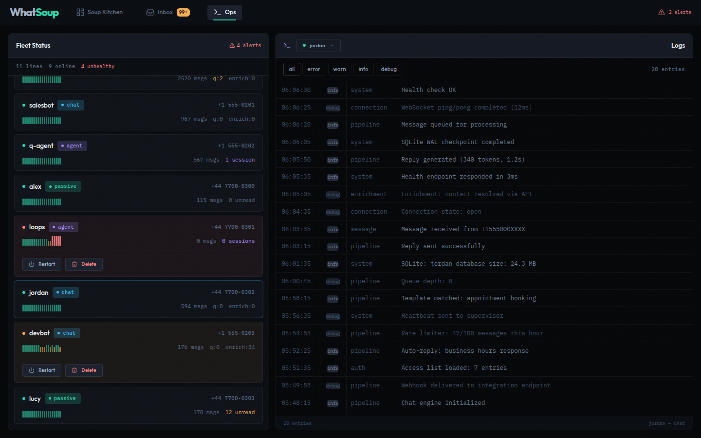
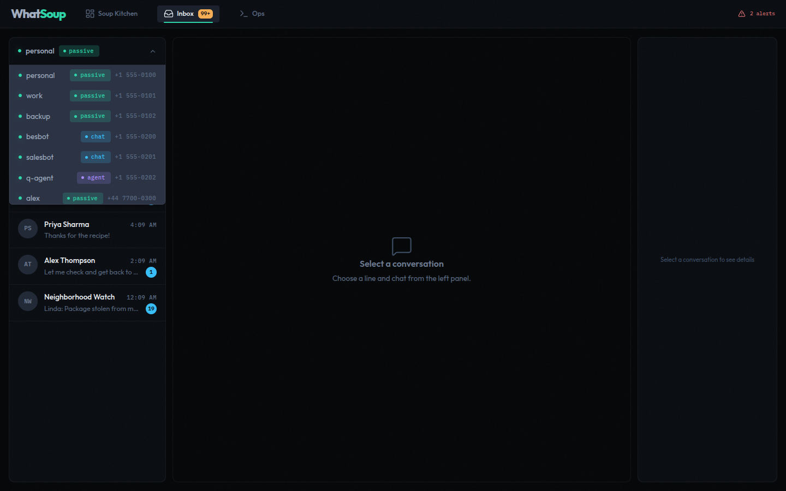
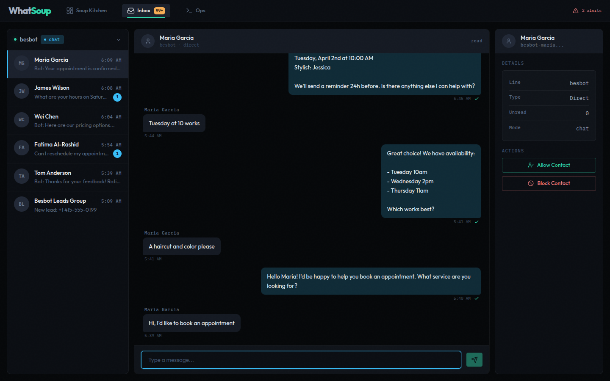
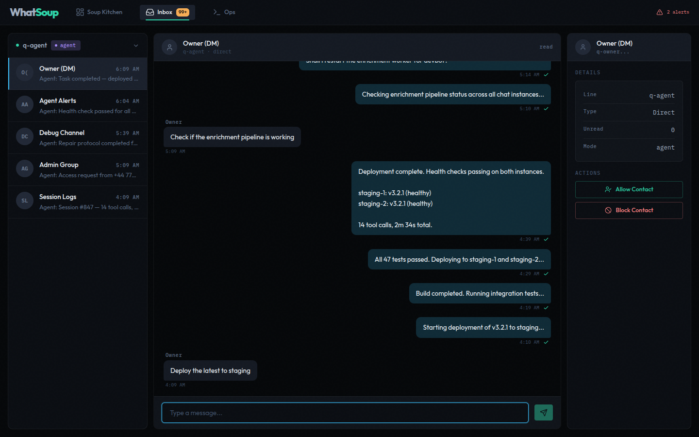
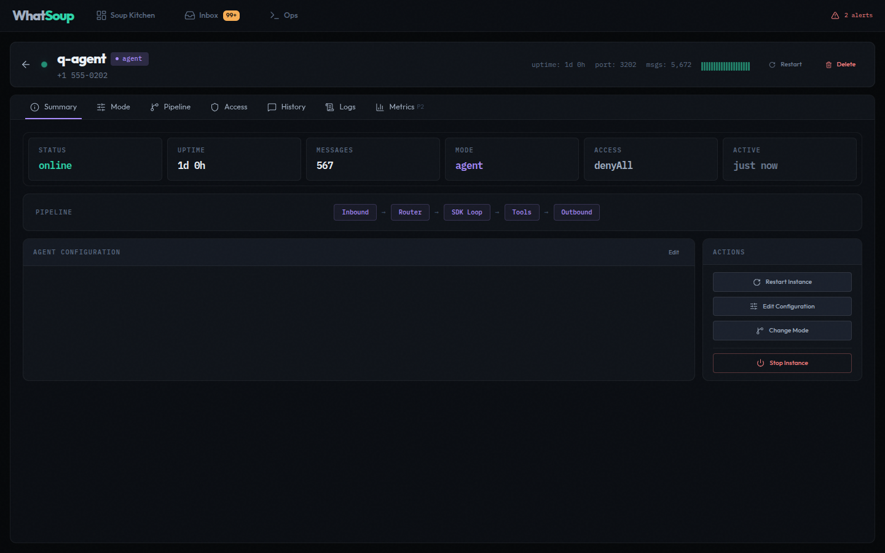
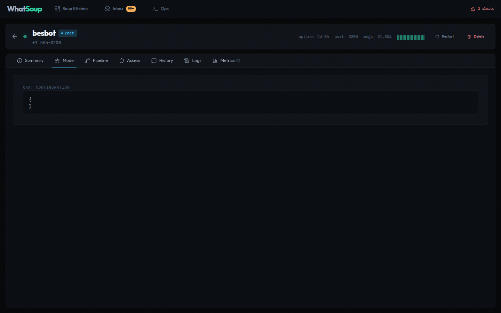
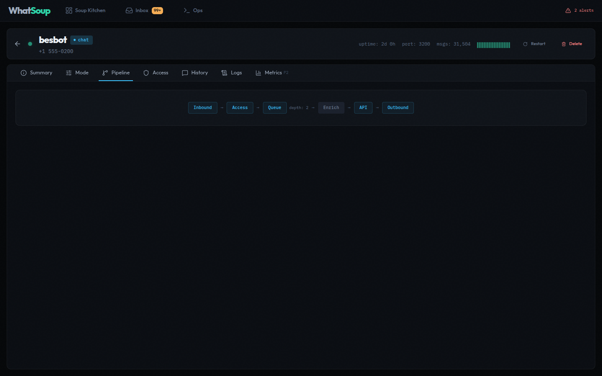
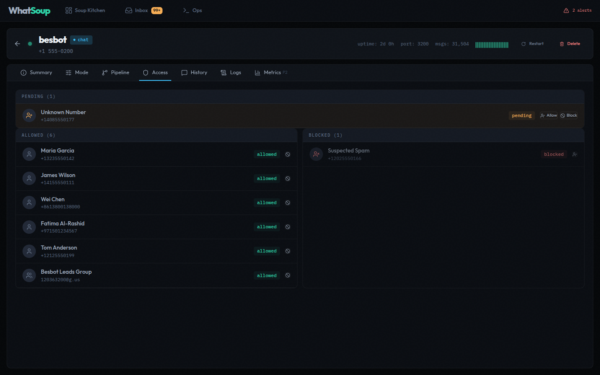
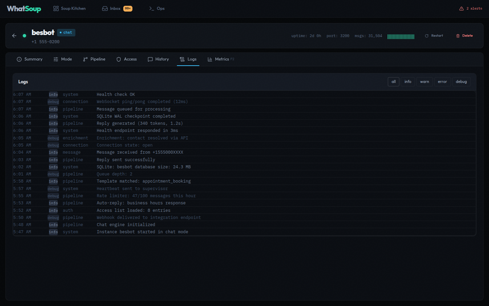

# Fleet Console Guide

The WhatSoup Fleet Console is a React dashboard for managing all WhatsApp instances from a browser. It runs on the same port as the fleet server in production (`http://localhost:9099`) or via Vite dev proxy during development.

## Pages

The console has four main pages accessible from the top navigation bar.

### Soup Kitchen (Fleet Overview)

The landing page. Shows fleet-wide KPIs, a connection table for all instances, and a live activity feed.


**KPI cards** across the top track: lines connected, lines needing attention, messages sent/received, active agent sessions, unread count, and media processed. Each card is clickable to filter the connection table.

**Alert banner** appears when instances are unhealthy — shows which lines need attention and why (auth expired, degraded, unreachable).

**Connection table** lists every instance with its mode badge, phone number, message counts, session stats, heartbeat strip, and status. Filter by mode (passive, chat, agent) or status (online, degraded, unreachable).

**Activity feed** on the right streams real-time events from all instances — messages, connections, errors, and session lifecycle events. Filter by category: messages, connections, errors, health, sessions.

### Ops (Operations)

Fleet health monitoring with instance management actions.


The left panel shows every instance with its status, phone number, message count, and session info. Unhealthy instances display restart and delete buttons inline.



The right panel shows a structured log viewer with level filtering (all, error, warn, info, debug). Select any instance on the left to view its logs. The log viewer shows timestamps, sources, and color-coded severity levels.

### Inbox

Unified message inbox across all instances. Read conversations, send replies, and manage contact access — all from one view.


**Line picker** (top-left dropdown) switches between instances. Shows each line's status, name, mode, and phone number.



**Chat list** shows conversations for the selected instance with contact avatars, last message preview, timestamps, and unread badges.

**Message view** renders the conversation with bubble-style messages. Outgoing messages appear on the right in the accent color; incoming messages on the left in a neutral tone.

**Contact details** panel (right side) shows the contact name, which line they're on, conversation type (direct/group), mode, and action buttons (Allow Contact / Block Contact).

#### Inbox by Mode

The inbox adapts to the selected instance's mode:

**Chat mode** — Shows bot conversations. Bot responses appear as outgoing messages with appointment confirmations, availability listings, and structured replies.



**Agent mode** — Shows autonomous agent sessions. The agent executes multi-step tasks (deployments, health checks, pipeline monitoring) and reports results back through the conversation.



### Line Detail

Detailed view for a single instance. Accessed by clicking an instance name in the fleet overview or navigating to `/lines/:name`.



The header shows the instance name, mode badge, phone number, uptime, port, message count, and linked status. Action buttons for restart and delete are always accessible.

#### Tabs

**Summary** — Status, uptime, message count, mode, access mode, last activity. Pipeline stage badges show the message processing flow. Action buttons for restart, edit configuration, change mode, and stop/delete.

**Mode** — Shows the current runtime configuration as JSON.



**Pipeline** — Visualizes the message processing stages: Inbound → Access → Queue → Match → Enrich → API → Outbound. Each stage is a clickable badge.



**Access** — Contact access control list. Shows pending requests, allowed contacts, and blocked contacts. Each entry shows the contact name, phone number, and status. Pending contacts have Allow/Block action buttons.



**History** — Chat conversations for this instance. Select a conversation on the left to view messages on the right.

**Logs** — Structured log viewer with level filtering (all, info, warn, error, debug). Shows timestamp, source, and message for each log entry.



**Metrics** — Performance metrics (Phase 2 — coming soon).

### Add Line Wizard

5-step provisioning flow for creating new instances. Accessed via the "Add Line" button on the fleet overview.


**Steps:**

1. **Identity** — Choose type (Passive, Chat, or Agent), set name, optional description, and admin phone numbers
2. **Link** — Scan QR code with WhatsApp to authenticate the instance
3. **Model** — Configure LLM models (conversation, extraction, validation) and API keys
4. **Config** — Set access mode, rate limits, system prompt, and advanced settings
5. **Review** — Confirm all settings before creating the instance

Type-matched accent colors distinguish the three modes throughout the wizard. Inline validation catches errors before submission.

## Design System

The console uses 60+ CSS custom properties and 40+ ESLint rules enforcing token usage. No hardcoded colors, spacing, or transition durations in components.

**Color palette:** Dark backgrounds with teal (passive), cyan (chat), and purple (agent) accent colors. Status indicators use teal (ok), orange (warn), and red (critical).

**Typography:** Outfit for UI text, IBM Plex Mono for code and data. Nine font sizes from 9.6px to 27.2px.

## Mock Mode

When the fleet server is unreachable, the console automatically falls back to built-in mock data. This is useful for:

- **Design iteration** — Work on the UI without running any WhatsApp instances
- **Demos** — Show the console to others without exposing real data
- **Development** — Test components with predictable, consistent data

Mock mode activates automatically (1.5s timeout on fleet API check) and re-checks every 60 seconds. All read operations use mock data; write operations (send message, restart, delete) require a live fleet server.

## Development

```bash
cd console && npm run dev          # Vite dev server with hot reload + API proxy
cd console && npm run build        # Build to dist/, served by fleet server
cd console && npm run lint         # ESLint with token enforcement rules
```

The dev server proxies `/api/*` requests to the fleet server at `http://127.0.0.1:9099` with automatic Bearer token injection from `~/.config/whatsoup/fleet-token`.
