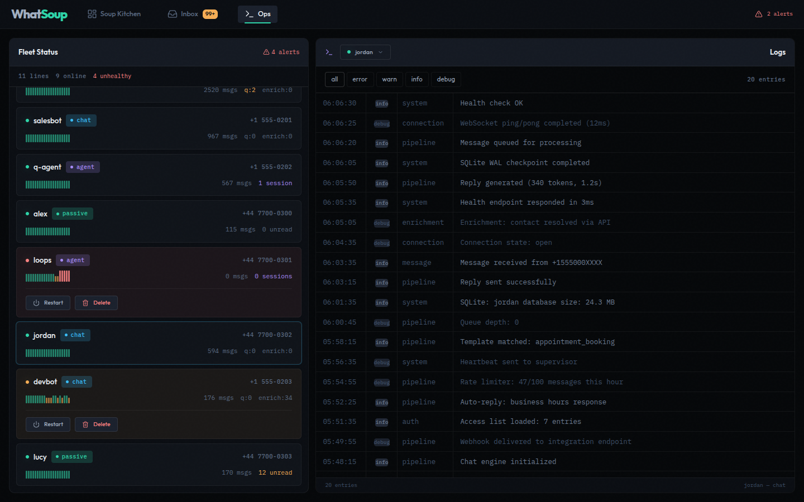
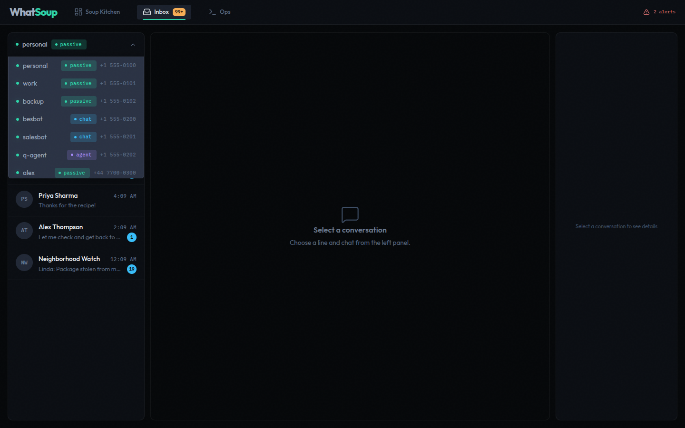
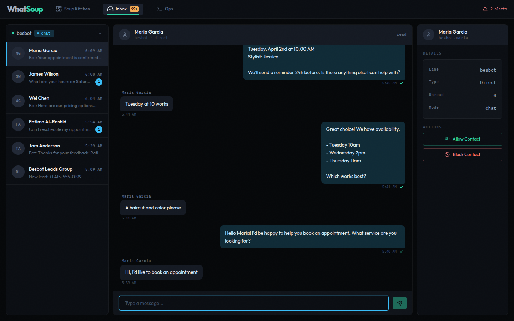
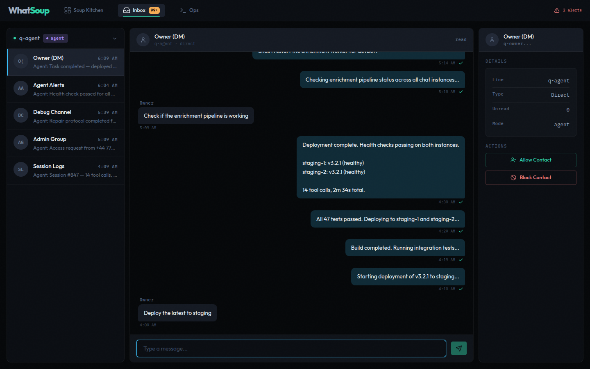
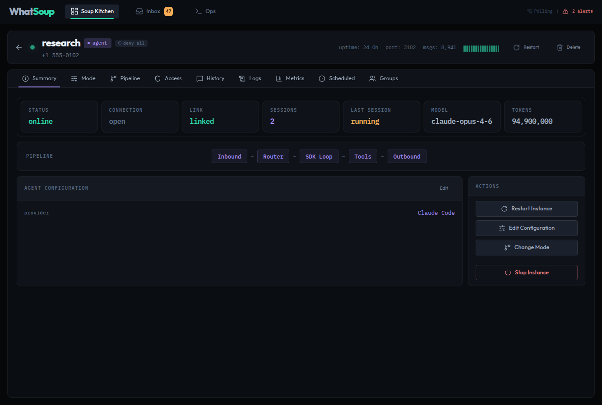
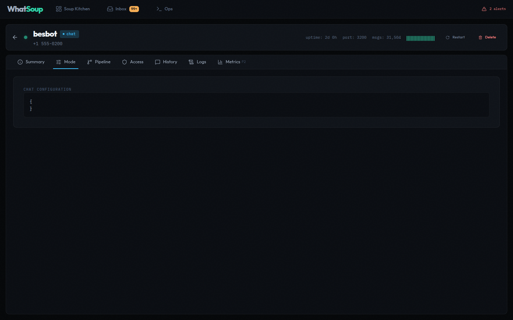
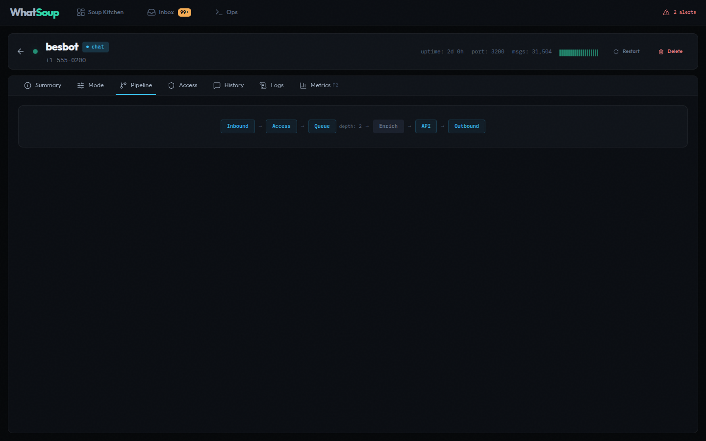
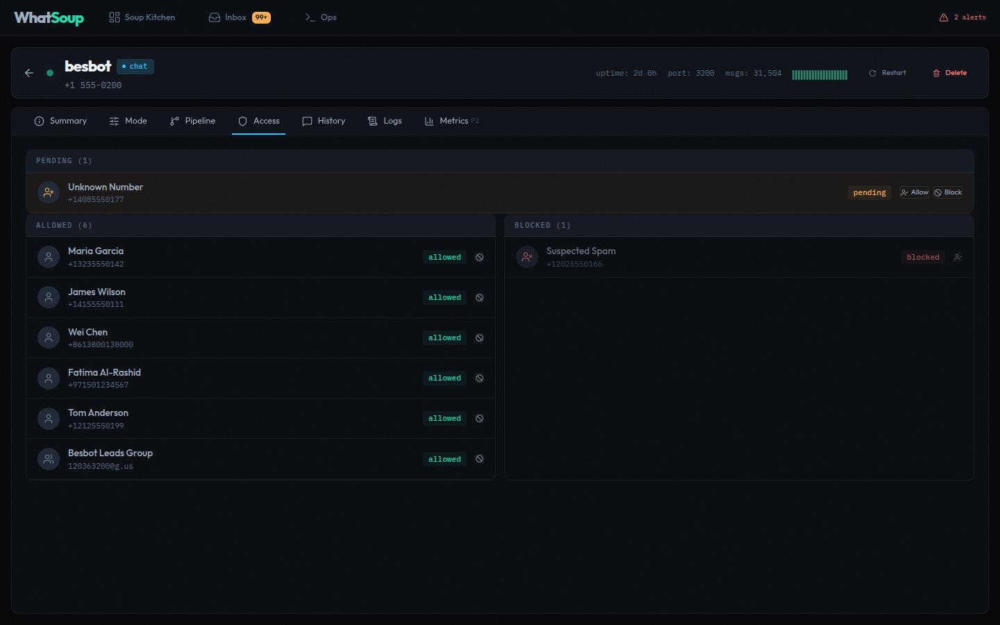
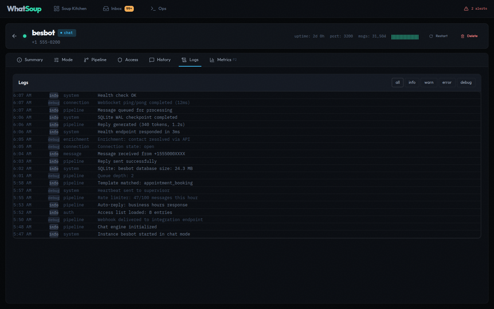
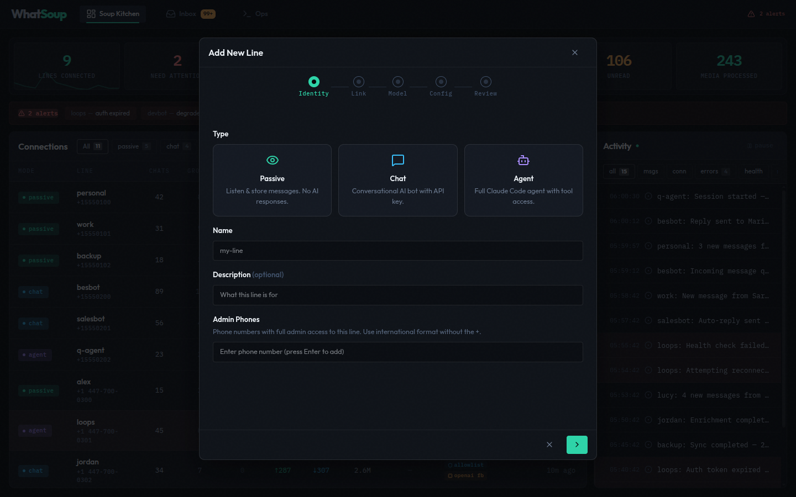

# Fleet Console Guide

The WhatSoup Fleet Console is a React dashboard for managing all WhatsApp instances from a browser. It runs on the same port as the fleet server in production (`http://localhost:9099`) or via Vite dev proxy during development.

## Console Authentication

In production the console starts **locked**. The served page carries no
credentials — enter the fleet token on the lock screen to start a session:

- The token is sent once to `POST /api/console-session` and never stored in
  the browser; the server answers with an HttpOnly `SameSite=Strict` session
  cookie (24-hour fixed lifetime).
- All API/WebSocket access then rides short-lived audience tickets minted
  against that session. A fleet-server restart relocks the console.
- To log out, click **Lock** in the top-right of the nav bar — it revokes the
  session server-side (`DELETE /api/console-session`), clears the cookie, and
  returns to the lock screen. (`DELETE /api/console-session` can also be called
  directly.)
- The fleet token lives in `~/.config/whatsoup/fleet-tokens.json` on the
  fleet host.
- Dev mode (Vite proxy) bypasses the lock screen — the proxy injects auth
  server-side and the page carries no `fleet-auth-mode` meta tag.

## Pages

The console has four main pages accessible from the top navigation bar.

### Soup Kitchen (Fleet Overview)

The landing page. Shows fleet-wide KPIs, a connection table for all instances, and a live activity feed.


**KPI cards** across the top track: lines connected, lines needing attention, messages sent/received, active agent sessions, unread count, and media processed. Each card is clickable to filter the connection table.

**Alert banner** appears when instances are unhealthy — shows which lines need attention and why (auth expired, degraded, unreachable).

**Connection table** lists every instance with its mode badge, phone number, message counts, session stats, heartbeat strip, and status. Filter by mode (passive, chat, agent) or status (online, degraded, unreachable).

**Activity feed** on the right streams real-time events from all instances — messages, connections, errors, and session lifecycle events. Filter by category: messages, connections, errors, health, sessions.

### Ops (Operations)

Fleet health monitoring with instance management actions.


The left panel shows every instance with its status, phone number, message count, and session info. Unhealthy instances display restart and delete buttons inline.



The right panel shows a structured log viewer with level filtering (all, error, warn, info, debug). Select any instance on the left to view its logs. The log viewer shows timestamps, sources, and color-coded severity levels.

### Inbox

Unified message inbox across all instances. Read conversations, send replies, and manage contact access — all from one view.


**Line picker** (top-left dropdown) switches between instances. Shows each line's status, name, mode, and phone number.



**Chat list** shows conversations for the selected instance with contact avatars, last message preview, timestamps, and unread badges.

**Message view** renders the conversation with bubble-style messages. Outgoing messages appear on the right in the accent color; incoming messages on the left in a neutral tone.

**Contact details** panel (right side) shows the contact name, which line they're on, conversation type (direct/group), mode, and action buttons (Allow Contact / Block Contact).

#### Inbox by Mode

The inbox adapts to the selected instance's mode:

**Chat mode** — Shows bot conversations. Bot responses appear as outgoing messages with appointment confirmations, availability listings, and structured replies.



**Agent mode** — Shows autonomous agent sessions. The agent executes multi-step tasks (deployments, health checks, pipeline monitoring) and reports results back through the conversation.



### Line Detail

Detailed view for a single instance. Accessed by clicking an instance name in the fleet overview or navigating to `/lines/:name`.



The header shows the instance name, mode badge, phone number, uptime, port, message count, and linked status. Action buttons for restart and delete are always accessible.

#### Tabs

**Summary** — Status, uptime, message count, mode, access mode, last activity. Pipeline stage badges show the message processing flow. Action buttons for restart, edit configuration, change mode, and stop/delete.

**Mode** — Shows the current runtime configuration as JSON.



**Pipeline** — Visualizes the message processing stages: Inbound → Access → Queue → Match → Enrich → API → Outbound. Each stage is a clickable badge.



**Access** — Contact access control list. Shows pending requests, allowed contacts, and blocked contacts. Each entry shows the contact name, phone number, and status. Pending contacts have Allow/Block action buttons.



**History** — Chat conversations for this instance. Select a conversation on the left to view messages on the right.

**Logs** — Structured log viewer with level filtering (all, info, warn, error, debug). Shows timestamp, source, and message for each log entry.



**Metrics** — Performance charts for this instance, scoped by a range selector (24h, 7d, 30d) and exportable as CSV.


Four charts render when data is available:

- **Message Volume** — Bar chart of inbound, outbound, and media counts per time bucket.
- **Active Hours Heatmap** — Range-aware activity view: 24h renders a collapsed hourly bar chart, 7d renders a day-by-hour heatmap, and 30d renders a date-by-hour heatmap when daily data is available or a weekly pattern heatmap otherwise.
- **Tokens** — LLM input/output token usage over time, broken down by provider (toggle in the Tokens/Sessions tab strip).
- **Sessions** — Active and newly started agent sessions over time, broken down by provider.

Below the charts, the tab also shows static cards for cumulative **Token Usage** (input/output totals with a proportion bar) and **Model Configuration** (each configured model role returned for the line, such as conversation, extraction, validation, and fallback when present).

The CSV export button (top-right of the range selector) downloads Message Volume buckets as `<line>-<range>.csv` with `bucket`, `inbound`, and `outbound` columns. Media counts are charted but not included in the CSV export.

Empty, loading, and error states each render an `EmptyState` panel: a loading panel while the request is in flight, an error panel with a Retry action when the request fails, and a "No metrics data" panel when the instance has not yet processed any messages.

Data is fetched from `GET /api/lines/:name/metrics?range=24h|7d|30d` (per-line) with the fleet-wide aggregate available at `GET /api/metrics?range=24h|7d|30d` for the Soup Kitchen view.

**Scheduled** — Queue of scheduled messages for this instance. The header bar shows the total count and a "New Scheduled Message" button that opens the composer modal. Each row exposes Cancel, Edit, and Duplicate actions; pending and processing messages sort to the top by send time, with sent / failed / cancelled rows below in reverse chronological order. The list polls every 30 s. Empty, loading, and error states each render an `EmptyState` panel. This tab is only shown for instances with a global MCP socket (not sandbox-per-chat). Backed by `GET/POST/DELETE /api/lines/:name/scheduled` (list, create, cancel-all) and `GET/PUT/DELETE /api/lines/:name/scheduled/:id` (fetch, update, cancel one) — see the Fleet API table in the README.

**Groups** — Groups this instance participates in. The header bar shows the total count and a "Create Group" button that opens the create modal. Each group card opens a detail modal with the participant list, promote / demote, add and remove participants, editable subject and description, invite link (get and revoke), ephemeral message duration, member-add mode (admins only vs all members), join-approval mode, pending join requests (approve / reject), and a Leave Group action. The list polls every 30 s. This tab is only shown for instances with a global MCP socket (not sandbox-per-chat). Backed by 15 routes under `/api/lines/:name/groups/...` (list, create, get detail, leave, subject, description, participants, settings, invite get and revoke, ephemeral, member-add-mode, join-approval, requests get and update) — see the Fleet API table in the README.

### Add Line Wizard

5-step provisioning flow for creating new instances. Accessed via the "Add Line" button on the fleet overview.



**Steps:**

1. **Identity** — Choose type (Passive, Chat, or Agent), set name, optional description, and admin phone numbers
2. **Link** — Scan QR code with WhatsApp to authenticate the instance
3. **Model** — Configure LLM models (conversation, extraction, validation) and API keys. Keys are stored in the OS keyring via the credentials API on finish — never written to config files. Services outside the API write allowlist (e.g. `groq`, `openrouter`) are provisioned from the CLI instead; the wizard shows the exact command.
4. **Config** — Set access mode, rate limits, system prompt, and advanced settings. For Agent instances this step also selects the AI **Provider**; API-type providers (`openai-api`, `anthropic-api`) reveal **Base URL** and **Keyring Service** fields for custom (BYOK) endpoints — see [Custom endpoint](configuration.md#custom-endpoint-providerconfigbaseurl). These provider fields are creation-time only; editing them later means editing `config.json` and restarting.
5. **Review** — Confirm all settings before creating the instance

Type-matched accent colors distinguish the three modes throughout the wizard. Inline validation catches errors before submission.

## Design System

The console uses 60+ CSS custom properties and 40+ ESLint rules enforcing token usage. No hardcoded colors, spacing, or transition durations in components.

**Color palette:** Dark backgrounds with teal (passive), cyan (chat), and purple (agent) accent colors. Status indicators use teal (ok), orange (warn), and red (critical).

**Typography:** Outfit for UI text, IBM Plex Mono for code and data. Nine font sizes from 9.6px to 27.2px.

## Mock Mode

When the fleet server is unreachable, the console can fall back to built-in mock data. This is useful for:

- **Design iteration** — Work on the UI without running any WhatsApp instances
- **Demos** — Show the console to others without exposing real data
- **Development** — Test components with predictable, consistent data

**Activation rules (closes #420):**

- **Development builds** (`npm run dev`) — Mock mode activates automatically (1.5s timeout on fleet API check) and re-checks every 60 seconds.
- **Production builds** (`npm run build`) — Mock mode is **disabled by default**. Real fleet/auth failures surface as errors so the UI can render a true unhealthy state instead of masquerading as healthy mock data. To opt back in for demos or static showcase builds, set the Vite env var `VITE_MOCK_MODE=1` at build time (e.g. `VITE_MOCK_MODE=1 npm run build`).

When mock mode is active, most read operations return deterministic mock data — line metadata, chats, messages, metrics, access lists, logs, feed/typing, scheduled messages, groups, and contact search. A few read endpoints intentionally still hit the live API: `searchMessages`, `getScheduledById`, `checkExists`, `checkDirectory`, and `getVersion`. Write operations always require a live fleet server.

## Development

```bash
cd console && npm run dev          # Vite dev server with hot reload + API proxy
cd console && npm run build        # Build to dist/, served by fleet server
cd console && npm run lint         # ESLint with token enforcement rules
```

The dev server proxies `/api/*` requests to the fleet server at `http://127.0.0.1:9099` with automatic Bearer token injection from `~/.config/whatsoup/fleet-tokens.json` (`active`). It falls back to the legacy `~/.config/whatsoup/fleet-token` file only when the rotatable token file is absent.
