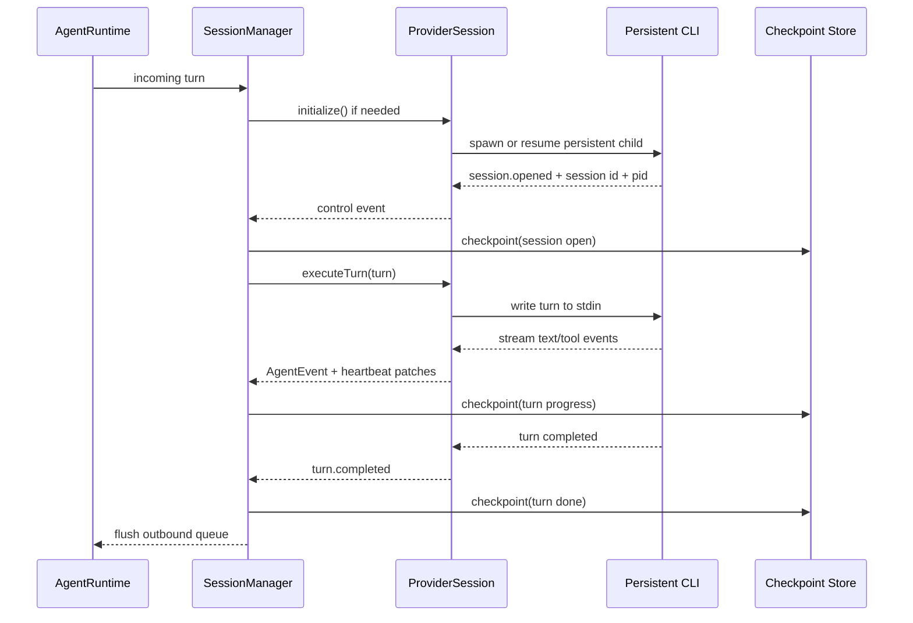
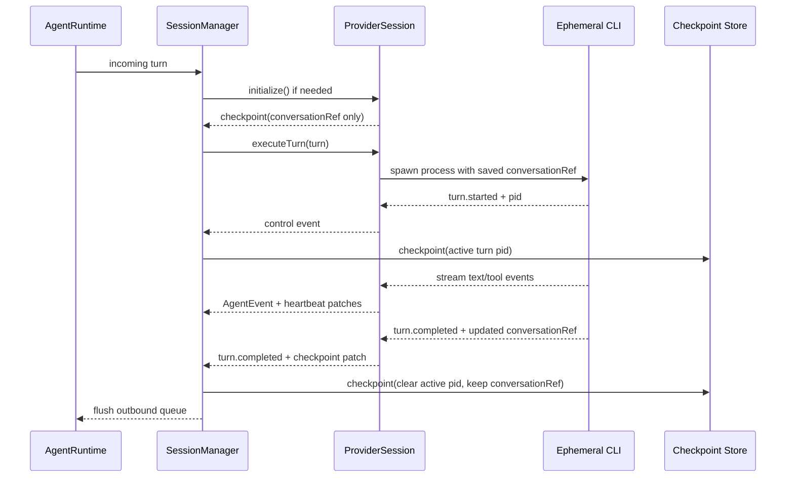
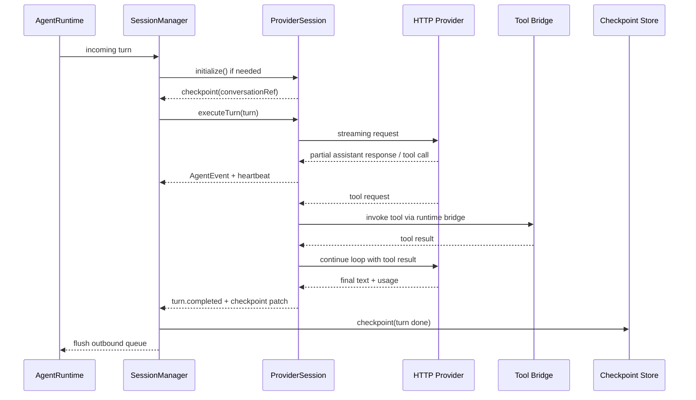

# Provider Interface Architecture Review

## Verdict

**changes-requested**

The current bead framing is directionally right, but the abstraction boundary is still too Claude-shaped. The primary split must be around **execution model** (`persistent_process` vs `ephemeral_process` vs `managed_loop`), not just `CLI` vs `API`.

## Findings

### Finding 1: Current persistence and recovery state is process-centric, so B01 cannot be solved in `providers/types.ts` alone

- Severity: high
- Confidence: high
- Evidence:
  - `src/runtimes/agent/session.ts:2-15,65-78,134-258`
  - `src/core/database.ts:163-179`
  - `src/core/durability.ts:36-59,223-278,295-340`
  - `src/runtimes/agent/session-classifier.ts:23-38,48-52,54-106,173-220`
- Impact:
  - Spawn-per-turn providers only have a live PID while a turn is running.
  - HTTP providers have no subprocess PID at all.
  - Current checkpoint/orphan logic assumes a long-lived `claude_pid`, a provider-owned `session_id`, and a filesystem `transcript_path`.
  - If B01 only adds an `AgentProvider` interface, recovery will still be wrong for Codex-style turn spawning and impossible for HTTP.
- Recommendation:
  - Generalize checkpoint/session persistence into provider-neutral fields plus provider state blobs.
  - Move orphan detection and crash recovery behind provider/session strategy hooks.
  - Treat PID and transcript path as optional transport metadata, not core session identity.

### Finding 2: The current spec still models resume as CLI argument construction instead of logical conversation restoration

- Severity: high
- Confidence: high
- Evidence:
  - `docs/sdlc/active/multi-provider-runtime-2026-0404/beads/B01-provider-interface.md:15-34`
  - `docs/sdlc/active/multi-provider-runtime-2026-0404/gap-analysis.md:96-105`
  - `src/runtimes/agent/session.ts:134-186,288-315,437-476`
- Impact:
  - `supportsResume()` and `buildResumeArgs(sessionId)` fit persistent CLI providers, but not:
    - spawn-per-turn providers, which resume a thread/conversation while creating a new process each turn
    - HTTP providers, which restore local conversation state and re-enter a managed tool loop
  - This will force `SessionManager` to branch on provider families and re-encode provider semantics the abstraction was supposed to hide.
- Recommendation:
  - Model restore as `ProviderSession.initialize({ checkpoint })`, not as "build some CLI args".
  - Keep provider conversation identity in a provider-neutral `conversationRef`.
  - Let each session strategy decide whether restore means spawning once, spawning per turn, or hydrating in-memory/API state.

### Finding 3: Tool/MCP/watchdog handling is currently coupled to Claude-like event timing and needs a control channel beyond `AgentEvent`

- Severity: medium
- Confidence: high
- Evidence:
  - `src/runtimes/agent/runtime.ts:1282-1345`
  - `docs/sdlc/active/multi-provider-runtime-2026-0404/gap-analysis.md:143-165`
  - `docs/sdlc/active/multi-provider-runtime-2026-0404/beads/B07-mcp-bridge.md:15-33`
  - `docs/sdlc/active/multi-provider-runtime-2026-0404/beads/B03-config-schema.md:15-64`
- Impact:
  - Current watchdog resets only on user-visible `AgentEvent` activity.
  - API providers may spend long periods inside tool loops or network streaming without emitting the same event cadence as Claude.
  - Spawn-per-turn providers need turn-scoped process handles and timeout overrides that are not represented in B03.
  - MCP bridging is not just "CLI file vs API function"; it also affects tool naming, status mapping, and replayability.
- Recommendation:
  - Introduce a provider-level control stream for turn start, heartbeat, crash, and checkpoint patches.
  - Keep `AgentEvent` as the normalized user-facing stream consumed by `runtime.ts`.
  - Expand config to include execution mode, watchdog policy, auth source, MCP mode, and provider-specific state.

## Recommended Architecture

### Core rule

`SessionManager` should manage a **logical conversation session**. Providers manage **how a turn executes**.

That means:

1. `AgentRuntime` still owns WhatsApp routing, outbound queueing, replay text, and access control.
2. `SessionManager` owns turn serialization, watchdog policy, checkpoint writes, and crash policy.
3. `ProviderSession` is the strategy object that hides whether work happens in:
   - one persistent subprocess
   - one subprocess per turn
   - one HTTP/tool-calling loop

### Why not split only on `CliProvider` vs `ApiProvider`

`CLI` vs `API` is a useful implementation convenience, but not the primary contract boundary:

- Claude persistent CLI and Codex spawn-per-turn CLI behave differently on resume, crash recovery, turn concurrency, and watchdog kill semantics.
- Codex spawn-per-turn and HTTP managed-loop are actually closer in lifecycle: both recreate an execution context every turn while preserving a higher-level conversation reference.

Use `CliProviderBase` and `ApiProviderBase` only as helper base classes. Do not make `SessionManager` branch on them.

## Interface Hierarchy

```ts
export type ProviderFamily = 'cli' | 'api';
export type ExecutionMode = 'persistent_process' | 'ephemeral_process' | 'managed_loop';
export type McpMode = 'config_file' | 'native_bridge' | 'none';
export type ToolMode = 'provider_native' | 'runtime_bridge' | 'none';

export interface ProviderDescriptor {
  kind: string;
  family: ProviderFamily;
  executionMode: ExecutionMode;
  mcpMode: McpMode;
  toolMode: ToolMode;
  supportsImages: 'native' | 'startup_only' | 'runtime_encoded' | 'none';
  supportsTranscriptLocator: boolean;
}

export interface WatchdogPolicy {
  softMs: number;
  warnMs: number;
  hardMs: number;
  idleHeartbeatMs?: number;
}

export interface TokenUsage {
  inputTokens?: number;
  outputTokens?: number;
  cachedInputTokens?: number;
}

export type RuntimeHandle =
  | { kind: 'pid'; pid: number }
  | { kind: 'request'; requestId: string }
  | { kind: 'none' };

export type TranscriptLocator =
  | { kind: 'file'; path: string }
  | { kind: 'provider'; ref: string }
  | { kind: 'none' };

export interface ProviderCheckpoint {
  providerKind: string;
  executionMode: ExecutionMode;
  conversationRef: string | null;
  activeTurnId: string | null;
  runtimeHandle: RuntimeHandle | null;
  transcript: TranscriptLocator | null;
  watchdogState: Record<string, unknown> | null;
  workspacePath: string | null;
  lastInboundSeq: number | null;
  lastFlushedOutboundId: number | null;
  providerState: Record<string, unknown>;
}

export interface SessionInitContext<Cfg> {
  conversationKey: string;
  chatJid: string;
  cwd?: string;
  instructionsPath?: string;
  mcpServers?: readonly McpServerBinding[];
  providerConfig: Cfg;
  checkpoint?: ProviderCheckpoint;
}

export interface TurnRequest {
  turnId: string;
  text: string;
  images?: readonly ImageInput[];
  signal: AbortSignal;
}

export interface TurnResult {
  turnId: string;
  usage?: TokenUsage;
  checkpointPatch?: Partial<ProviderCheckpoint>;
}

export type ProviderControlEvent =
  | { type: 'session.opened'; conversationRef: string | null; runtimeHandle?: RuntimeHandle | null; transcript?: TranscriptLocator | null }
  | { type: 'turn.started'; turnId: string; runtimeHandle?: RuntimeHandle | null }
  | { type: 'activity.heartbeat'; turnId: string; pendingTools?: string[] }
  | { type: 'checkpoint.patch'; patch: Partial<ProviderCheckpoint> }
  | { type: 'turn.completed'; turnId: string; usage?: TokenUsage }
  | { type: 'turn.failed'; turnId: string; retryable: boolean; error: string }
  | { type: 'session.crashed'; runtimeHandle?: RuntimeHandle | null; error: string };

export interface ProviderEventSink {
  onAgentEvent(event: AgentEvent): void;
  onControlEvent(event: ProviderControlEvent): void;
}

export interface ProviderSession {
  readonly descriptor: ProviderDescriptor;

  initialize(): Promise<ProviderCheckpoint>;
  executeTurn(request: TurnRequest, sink: ProviderEventSink): Promise<TurnResult>;
  interrupt?(reason: 'user' | 'watchdog' | 'shutdown'): Promise<void>;
  shutdown(mode: 'suspend' | 'end'): Promise<Partial<ProviderCheckpoint>>;
  snapshot(): Promise<ProviderCheckpoint>;
  recover?(sink: ProviderEventSink): Promise<'resumed' | 'fresh'>;
}

export interface AgentProvider<Cfg = AgentProviderConfig> {
  readonly descriptor: ProviderDescriptor;
  readonly defaultWatchdog: WatchdogPolicy;

  createSession(ctx: SessionInitContext<Cfg>): Promise<ProviderSession>;
  classifyRecovery?(checkpoint: ProviderCheckpoint): Promise<'resume' | 'restart' | 'replay_turn' | 'manual'>;
}
```

### Recommended config shape

```ts
interface ProviderConfigBase {
  kind: string;
  model?: string;
  watchdog?: Partial<WatchdogPolicy>;
}

interface PersistentCliProviderConfig extends ProviderConfigBase {
  family: 'cli';
  executionMode: 'persistent_process';
  binary: string;
  args?: string[];
  env?: Record<string, string>;
  pluginDirs?: string[];
}

interface EphemeralCliProviderConfig extends ProviderConfigBase {
  family: 'cli';
  executionMode: 'ephemeral_process';
  binary: string;
  args?: string[];
  env?: Record<string, string>;
  resumeStyle: 'thread_id' | 'session_id' | 'none';
}

interface ApiProviderConfig extends ProviderConfigBase {
  family: 'api';
  executionMode: 'managed_loop';
  baseUrl: string;
  apiKeyService: string | null;
  requestTimeoutMs?: number;
  toolChoice?: 'auto' | 'required' | 'none';
}

export type AgentProviderConfig =
  | ClaudeProviderConfig
  | CodexProviderConfig
  | GeminiProviderConfig
  | OpenCodeProviderConfig
  | OpenAICompatibleProviderConfig
  | AnthropicApiProviderConfig;
```

## SessionManager Responsibilities

`SessionManager` should become a provider-agnostic orchestrator with this lifecycle:

1. Build `SessionInitContext` from instance config, workspace info, MCP bindings, and persisted checkpoint.
2. Create one `ProviderSession` from the selected `AgentProvider`.
3. Serialize incoming turns and call `executeTurn()`.
4. Consume:
   - `AgentEvent` for outbound queue rendering
   - `ProviderControlEvent` for watchdog, checkpoint, and crash policy
5. Persist a provider-neutral checkpoint after:
   - session open
   - turn start
   - heartbeat / provider patch
   - turn completion
   - crash / suspend / end

The strategy pattern is therefore:

- `SessionManager` = stable orchestration shell
- `ProviderSession` = pluggable execution strategy

## Base Classes

These are worth adding, but only as implementation helpers:

### `CliProviderBase`

Shared responsibilities:

- binary resolution
- env and cwd assembly
- stdout/stderr line framing
- child spawn and abort helpers
- optional transcript discovery helpers

Should not assume:

- persistent child ownership
- stdin-based turns
- resume via CLI args only

### `ApiProviderBase`

Shared responsibilities:

- auth lookup
- SSE / chunked stream parsing
- AbortController lifecycle
- tool schema conversion helpers
- request/response error classification

Should not assume:

- a specific tool-calling schema
- a specific provider message format

## Durability And Recovery

### General rule

Checkpoint the **logical conversation**, not the transport.

### Persistent session providers

- `conversationRef` is the provider session/thread id.
- `runtimeHandle` is the live child PID.
- Hard watchdog can kill the child and attempt `recover()`.
- Pre-start recovery can still do PID liveness checks, but only for providers whose `runtimeHandle.kind === 'pid'` and whose execution mode is persistent.

### Spawn-per-turn providers

- `conversationRef` is the provider thread/session id that survives across turns.
- `runtimeHandle` is the current turn PID only while a turn is active; otherwise `null`.
- Crash recovery normally means spawning a new process for the pending turn with the saved `conversationRef`.
- No orphan sweep should run when there is no active turn handle.

### HTTP managed-loop providers

- `conversationRef` is usually a local conversation id or remote response thread id.
- `runtimeHandle` is `{ kind: 'request', requestId }` during an active request, else `null`.
- Hard watchdog aborts the request via `AbortController`.
- Recovery is local replay from checkpoint + tool journal; there is no provider subprocess to reap.

### Schema implication

`session_checkpoints` and `agent_sessions` should stop using `claude_pid` as the primary runtime field. The minimum viable generalization is:

- add `provider_kind`
- add `execution_mode`
- replace `claude_pid` with nullable `runtime_handle_kind` + `runtime_handle_value`
- replace `transcript_path` with nullable `transcript_locator_kind` + `transcript_locator_value`
- add `provider_state` JSON

Backward compatibility can keep old columns during migration, but new logic should read/write the neutral form first.

## Lifecycle Diagrams

### 1. Persistent process provider



### 2. Spawn-per-turn provider



### 3. HTTP managed-loop provider



### 4. Crash / watchdog recovery

```mermaid
flowchart TD
  A[Process restart or watchdog fire] --> B[Load ProviderCheckpoint]
  B --> C{executionMode}
  C -->|persistent_process| D[Check live pid if runtime handle exists]
  D --> E{pid alive and provider recoverable?}
  E -->|yes| F[provider.recover()]
  E -->|no| G[spawn fresh session and replay pending turn]
  C -->|ephemeral_process| H{active turn pid exists?}
  H -->|yes| I[kill/mark abandoned turn]
  H -->|no| J[reuse conversationRef]
  I --> J[spawn fresh turn with saved conversationRef]
  C -->|managed_loop| K[abort pending request if needed]
  K --> L[rebuild tool loop from checkpoint]
  F --> M[resume completed]
  G --> M
  J --> M
  L --> M
```

## Recommended bead changes

1. Expand B01 from "provider interface" to "provider session strategy + provider-neutral checkpoint contract".
2. Expand B03 to carry:
   - `executionMode`
   - watchdog overrides
   - auth source
   - MCP mode
   - provider-specific config union
3. Expand B07 to normalize tool naming/status mapping in addition to MCP config transport.
4. Add a small persistence bead for schema generalization if the existing durability/session tables must remain authoritative for recovery.
